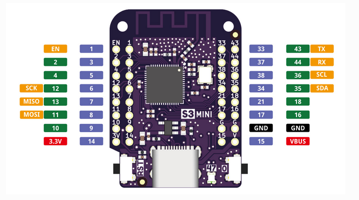
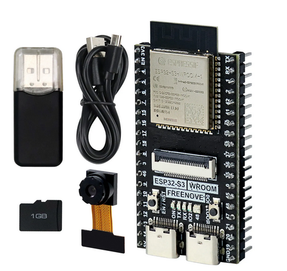

# TinyML
These are demo programs for a course on TinyML at the University of Cape Coast, Ghana.

The repository is based on the examples in the [tflite micro repository](https://github.com/tensorflow/tflite-micro). There you find the following examples:
* Hello World
* memory_footprint
* mnist_lstm
* network_tester (not used)
* person_detection
* recipes

In addition the _magic wand_ examples from the [TinyML book](https://zlib.pub/book/tinyml-machine-learning-with-tensorflow-lite-on-arduino-and-ultra-low-power-microcontrollers-vshhregc28o0) will be ported to the ESP32.

The tflite micro repository now uses _bazel_ to build its programs. Some of the jupyter notebooks described in the TinyML book are not available any longer. I rebuilt these notbooks and included them in this repository.
The hardware I use is the following:

The WeMos ESP32S3 CPU comes with 4 MBytes of flash and 2 MBytes of PSRAM. The pinout is shown below:

A user LED in form of a ws2812 rgb LED is available on GPIO 47. This CPU is best when either a microphone (wake word example) or an accelerometer (magic wand) is required. These devices are mounted on WeMos D1 mini prototype shield and can then easily be connected to the CPU via the triple board (bus board).

For the person detection demo a camera is required. Here I use the FreeNove ESP32S3 WROOM kit. It features 8 MBytes flash, 8 MBytes of octal SPIRAM and an OV2640 camera. Images can be saved on an SD card for which an interface is available.

# This is work in progress and some of the programs may not work yet 
