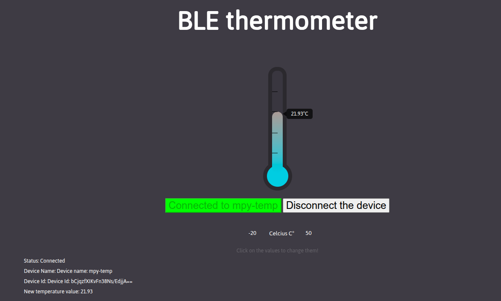

# BLE Thermometer
This directory contains the files needed to run a BlueTooth thermometer,
displayed on a WEB site with a nice thermometer widget.
You will need a ds18b20 digital thermometer connected to your ESP32S3 mini. It is
however not really difficult to modify the code to use a different type of
thermometer like the SHT30 or the dht11.
To get the WEB page onto the screen, you can either start it with Live Server
or you can simple use a file URL (file:///abs_location_of_your_html_file)
Here is the sequence of steps:
* Start temp_sensor.py on the ESP32. The LED will blink fast.
* Start `html/ble_temp.html` on your PC
* Press the connect button and select mpy-temp for pairing
* This will connect the WEB page (BLE central) with the ESP32 (BLE peripheral). The LED on the ESP32 will be steady on and you should see the thermometer update with the temperature values mesured by the peripheral.
This is what you should see on the screen:

You may click on the min and max values or on the unit (Celsius) to change them.