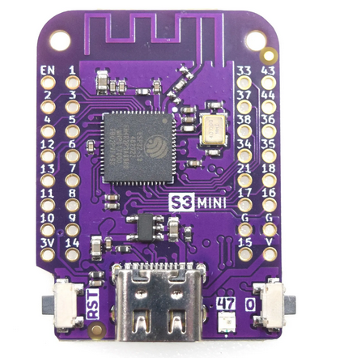

# The BLE demo program
ble_demo.py is the program to look at. It runs on an ESP32 S3FH4R2 board using the GPIO-0 button as well as the user LED (a ws2812) connected to GPIO 47.
The other programs have been written to check out how to make
* the GPIO-0 button
* the ws2812 LED
* BLE advertising work

  
  
The demo program advertises its NUS service (Nordic UART Service) and waits for a connection. During wait, the LED blinks at high frequency (1 Hz). Once a central has connected, the LED remains in a steady "on" state. A BLE terminal (e.g. the ble_terminal app on the smart phone) can be used to connect to the ESP32. After connection it can retrieve the current LED state with the command _read_LED_.

When pushing the GPIO-0 button, the LED state is toggled and a message _LED state will be toggled_ is send to the central.
